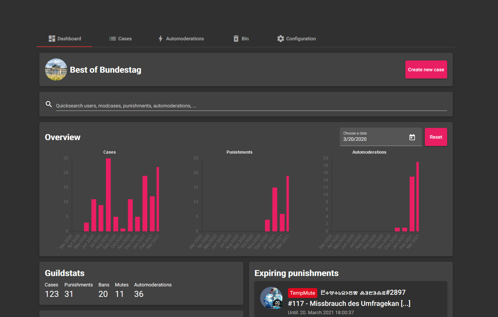
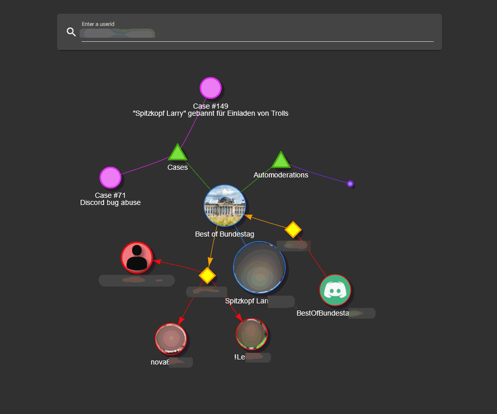
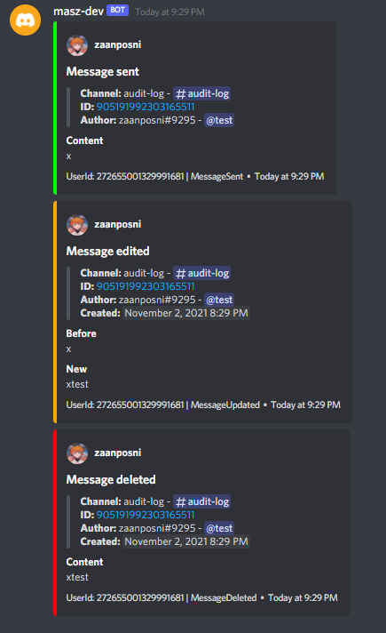
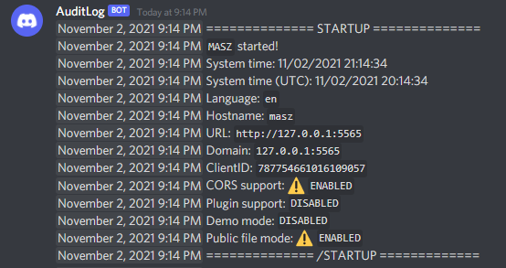

# Preview

## Dashboard

## Userscan

## Modcase overview

## Guild audit log

## Audit log

## Detailed view for single modcase

## Commands to punish in discord

## Configuration for automoderation

## Logs for automoderated events

## ModCase Notification embed for your guild members and moderation team

## Comment Notification embed for your moderation team

## Modcase creation

