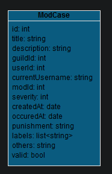

# Discord MASZ

Dieses Projekt soll die Arbeit der Moderatoren größerer Discordserver entlasten, vereinheitlichen und verbessern. 

Konkret bietet es die Möglichkeit alle möglichen Details zu einem Modcase zu speichern, anzupassen oder zu teilen.

Das Herzstück bildet jedoch eine zentrale Suchfunktion, die es möglich machen soll einen User, ein Stichpunkt, oder Ähnliches zuverlässig in der Datenbank zu suchen und genaue Details zu allen bekannten Ereignissen zu bekommen. Hierbei soll es keine Rolle spielen, ob der User beispielsweise seinen Namen ändert oder der Name nur ähnlich geschrieben wird.

An verschiedenen Stellen soll im Workflow der Caseregistrierung auch Discordintegrationen entstehen, beispielsweise kann die Discord API verwendet werden, um Details über Nachrichten zu fetchen und vollständig abzulegen, oder es können Notifications an Moderatoren geschickt werden.

Auf lange Sicht soll das Projekt serverunabhängig sein und es soll die Möglichkeit geben, dass Moderatoren sowohl serverintern als auch global das System bedienen.

Das Projekt besteht also aus einer Rest API einer Discord Integration und einem Frontend in einer beliebigen Technologie.

Eine erste Version der ModCase-Klasse sieht wie folgt aus:

