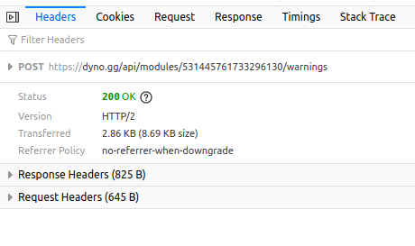

# Scripts

## Backups

Use the scripts `backup_db.sh` and `backup_files.sh` as examples to backup your MASZ instance.

## Migrate from dynobot to masz

To migrate your warnings from dynobots database to masz follow this guide:

- Visit the warnings dashboard in your browser at dyno.gg/manage/guildid/warnings
- Use F12 or similiar to catch the request your browser sends to (POST /warnings), you might have to hit F5, find something like this:



- Send the request again and change the page size to something that is big enough so all modcases are one page (this way you have to follow this guide only one time)
- Now you got a response that looks like this:
```json
{
    "logs": [
        {
            "_id": "dummy",
            "guild": "dummy",
            "users": { },
            "mod": { },
            "reason": "dummy",
            "createdAt": "dummy",
            "__v": 0
        }
    ],
    "pageCount": 1
}
```
- In firefox do right click > copy all 
- Paste this content into a file e.g. `input.json`
- Execute the script `migrate_dyno_warnings.py` by using:
```py
python3 -m pip install -r requirements.txt
python3 migrate_dyno_warnings.py --input-file input.json
```
- Copy the output generated in `output.sql`
- Access the bash shell of your running db container: `docker exec -it masz_db bash`
- Connect to the mysql shell using `mysql`
- Execute `USE masz` and then paste the content of `output.sql` and press enter
- You should be ready to see your migrated data in the frontend

Note that the CaseId is auto incremented by the python script. If you already have data in your database of this guild, you have to adjust the starting value in line 46 to be higher than the highest id in your guilds records.